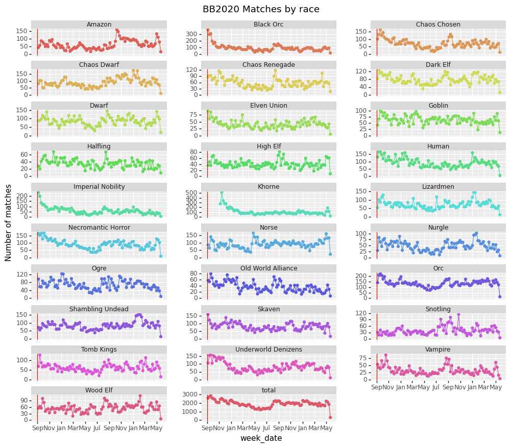
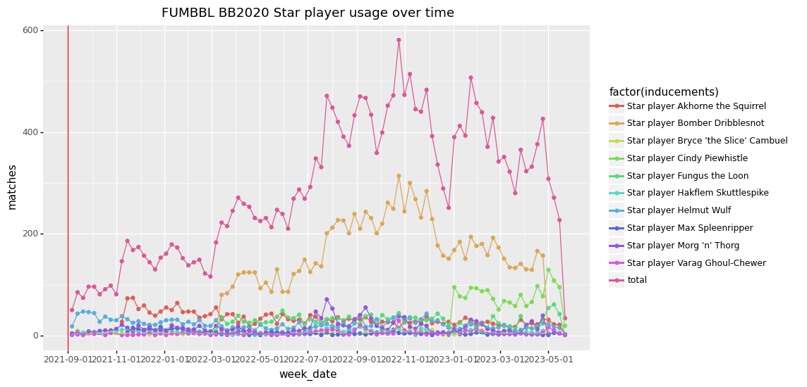

# fumbbl_datasets
This repository hosts the FUMBBL datasets scraped from https://www.fumbbl.com .
Scraping is semi-automated and is done at irregular intervals.

The folder `datasets` contains the current and previous releases. 
see `CHANGELOG` for details.

The folder `analysis/` contains Rmarkdown and Jupyter notebooks with additional analyses.

Two example plots using data from an older release:

## BB2020 matches by race by week

## Top 10 star player usage by week

