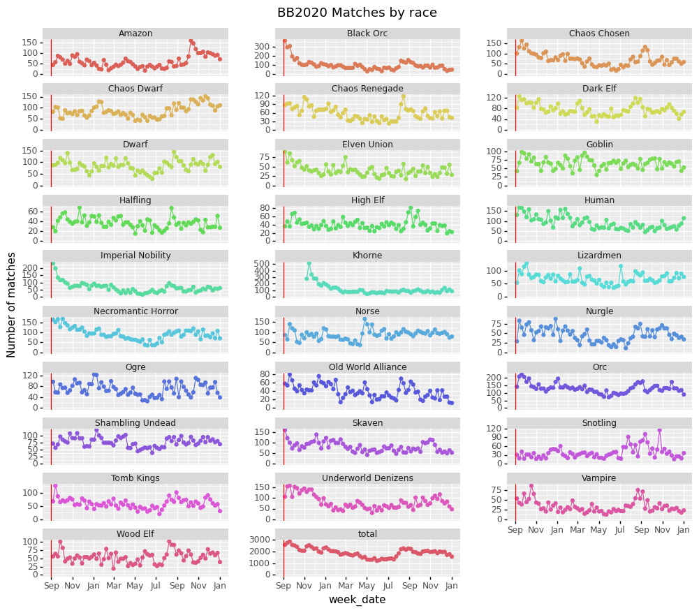
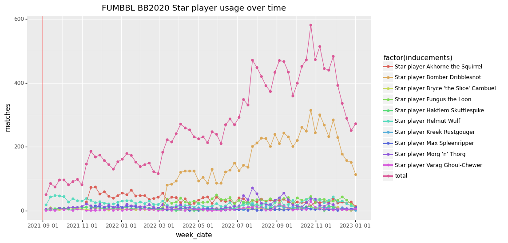

# fumbbl_datasets
This repository hosts the FUMBBL datasets scraped from https://www.fumbbl.com .
Scraping is semi-automated and is done at irregular intervals.

The Jupyter Notebook `fumbbl_dataset.ipynb` contains the current scraping and data processing code that produces the current release of the datasets.

The folder `datasets` contains the current and previous releases. 
see `CHANGELOG` for details.

The folder `raw` contains the raw data that works with the current code to produce the latest release.

See https://gsverhoeven.github.io/post/blood-bowl-fumbbl-dataset/ for a data paper describing a previous version of these datasets (v0.1).

The folder `analysis/` contains Rmarkdown and Jupyter notebooks with additional analyses.

Two example plots using data from the current release:

## BB2020 matches by race by week

## Top 10 star player usage by week

