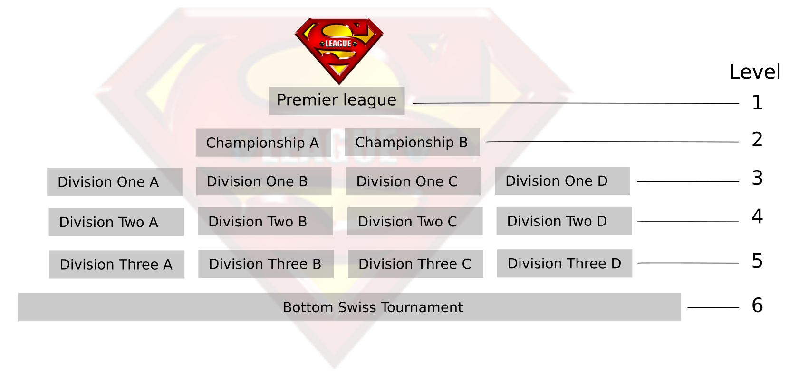

# HOW TO RUN:

Do github clone repo: https://github.com/gsverhoeven/fumbbl_datasets/

Go to folder datasets/v0.6
extract Zip file into datasets/current


TODO:

-fix coach problem (>8 coach names)
-57864 tournament needs to be dropped.
-Need to add scores (tie breakers).


```{r setup, include=FALSE}
library(tidyverse)
knitr::opts_chunk$set(echo = TRUE)
options(dplyr.summarise.inform = FALSE)
```

# Read in data

```{r}
df_matches <- read.csv(file = "../datasets/current/df_matches.csv")
df_matches <- df_matches %>%
  filter(group_id == 15615) # TSL

df_matches$match_date <- as.Date(df_matches$match_date)
df_matches$week_date <- as.Date(df_matches$week_date)
```

```{r}
df_mbt <- read.csv(file = "../datasets/current/df_mbt.csv")
df_mbt <- df_mbt %>%
  filter(group_id == 15615) # TSL

df_mbt$match_date <- as.Date(df_mbt$match_date)
df_mbt$week_date <- as.Date(df_mbt$week_date)

df_mbt[df_mbt$race_name == "Khorne",]$bb2020_nov21_tier <- 2
df_mbt[df_mbt$race_name == "Khorne",]$bb2020_tier <- 2
```

Fix coach name changes

```{r}
df_mbt[df_mbt$coach_name == "Edwin25301",]$coach_name <- "Edwin"
```

# Add seasons, levels

```{r}
cl <- as_tibble(read.csv2("spl_seasons_div.csv")) %>% select(-tournament_name)
```

```{r}
df_matches <- df_matches %>%
  left_join(cl, by = "tournament_id")

df_mbt <- df_mbt %>%
  left_join(cl, by = "tournament_id")
```

https://fumbbl.com/p/group?op=view&at=1&group=15615&p=tournaments&show=58581

```{r}
df_mbt %>% filter(tournament_id == 58588) %>% distinct(coach_name) 
df_mbt %>% filter(tournament_id == 59507) %>% distinct(coach_name) 
```

# narrative blog post

relationship with Elo/Glicko.
What is the purpose of the system?
We want to know who is currently the best.
We cannot let everybody play everybody, we have a limited number of "measurements".


# WHAT IS THE SUPER LEAGUE?



This is a competitive resurrection (non-progression) league which uses promotion and relegation.The exact structure will be decided (depending on player numbers) at the start of each season.

Season Two is using a pyramid structure as follows:
*  Premier League: 1 Champion - 4 relegated
*  Championship A+B: 2 promoted - 4 relegated
*  Division One A,B,C+D: 2 promoted - 4 relegated
*  Division Two A,B,C+D: 4 promoted - 4 relegated
*  Division Three A,B,C+D: 4 promoted - 4 relegated
*  Bottom Swiss: 16 promoted.

Bottom division will be a swiss tournament.
Relegation will depend on league expanding next season.

The league placing belongs to the **coach**. 
So you can swap teams (between seasons) and retain your ranking. 
Coaches who are brand new will start from the bottom and have to work their way up.

# Generate coach / match counts by tournbament

```{r}
res <- df_mbt %>%
  group_by(tournament_id, tournament_name, coach_name, season, level) %>%
  summarise(n_matches = n_distinct(match_id))

writexl::write_xlsx(res, "spl_seasons_div2.xlsx")
```

## THE COMMITMENT

To organise and play 1 game of Blood Bowl every 2 weeks (14 days). Your opponent may live in a different country/ different time zone - so you may need to be flexible.

Tips on how to schedule properly: https://fumbbl.com/p/blog&c=ArrestedDevelopment&id=22745

Two weeks should be plenty of time to organise to play a game. But if there are any problems please tell group admins nice and early.

If you do not respond to your opponent or league admin during the 14 day period - you will be thrown out of the competition and replaced.

If a game is not played within deadline and an extension has not been requested. Admin will toss a coin and attribute the win accordingly.

Re Time Outs: remember you are adults and act accordingly.

### Taking a break: 

If a coach rejoins the league after pausing for one or more seasons, they may play in the tier they qualified for with their placement in their last active season, provided there is a space available due to dropouts. Otherwise they get placed as high as possible (but not higher than what they qualified for). If multiple coaches are competing for the same space in a tier, the coach with the shorter break gets the space.
Placements from Season 0 and coaches who dropped out during a running season do not qualify for this rule.

## THE RULES

Win = 2 points, Draw = 1 point, Loss = 0 points

Tie breaker = NET TD + NET CAS. No tie breaker is perfect but this is the default setting, so makes life easier for everyone. If this is equal we'll look at H2H and then TD scored + Cas Caused.

IMPORTANT - Please only chose the inducements listed in your Bio when starting a game.

If you get this wrong and the game must be reset you will need to contact a FUMBBL Admin! LEAGUE ADMIN DO NOT have the power to reset your game. If a game is not played inside the time limit because it has to be reset the player that chose the wrong inducements MAY have to forfeit.

The Fumbbl Discord is the best place to request a reset!
https://discord.gg/4cqE66JqEd

## TEAM CREATION

Please select "Create Team for this League" at the top of this page.

Minimum of 11 players

In order to award skills to your players - please use Team Options - Skill Settings. Only one skill per player allowed unless tiering permits it.

All boxes must be filled. Therefore you may need to select "No Skill" for some of your players.

If you wish to purchase inducements simply leave the cash in your treasury and select them at the start of the in game sequence. Please clearly say which inducements you are using in your Team Bio.

When created please return to this group - Click on "Teams" select your team from the drop down menu at the bottom and select "Apply for Membership"

TV1100, no skill stacking, Inducements: 0-2 Bloodweiser Kegs; Tier 5 Extra Inducements: Chef, Riotous Rookies, Bribes (not with Sneaky Git)

Tier 1 (5 Primary Skills): Amazon, Dark Elf, Dwarf, Orc, Shambling Undead, Skaven, Underworld Denizens;

Tier 2 (5 Primary Skills + 50k Treasury): Chaos Dwarf, Lizardmen, Norse, Wood Elf;

Tier 3 (6 Primary Skills + 50k Treasury): Elven Union, High Elf, Human, Necromantic Horror, Slann, Tomb Kings;

Tier 4 (7 Primary Skills + 50k Treasury): Black Orc, Chaos Chosen, Chaos Renegade, Imperial Nobility, Nurgle, Old World Alliance, Khorne, Vampire;

Tier 5 (6 Primary Skills + 1 Secondary Skill + 50k Treasury + extra Inducements): Goblin, Halfling, Ogre, Snotling;


## Past Champions:

Season 0:
Winner: Storr (Darkelf)
Season 1:
Premier League Winner: Strider84 (Skaven)
Championship Winners: Purplegoo (Skaven) and LemonheadWallenstein (Norse)
Season 2:
Premier League Winner: Purplegoo (Skaven)
Championship Winners: Storr (Darkelf) and Siggi (Amazon)

## using the "Take a break rule". 

```
"Taking a break: If a coach rejoins the league after pausing for one or more seasons, they may play in the tier they qualified for with their placement in their last active season, provided there is a space available due to dropouts. Otherwise they get placed as high as possible (but not higher than what they qualified for). If multiple coaches are competing for the same space in a tier, the coach with the shorter break gets the space.
Placements from Season 0 and coaches who dropped out during a running season do not qualify for this rule."
```

Seeding are handled in sheets atm.

# Straight up win rates 

```{r fig.height= 8, fig.width = 8}
res <- df_mbt %>%
  filter(group_id == 15615) %>%
  group_by(race_name, race_type, bb2020_nov21_tier) %>%
  summarise(n_games = n(),
            win_rate = mean(wins))

ggplot(res, aes(x = reorder(race_name, win_rate), y = win_rate, col = factor(bb2020_nov21_tier))) +
  geom_point(aes(size = n_games)) + coord_flip() + expand_limits(y = 0) +
  scale_size_area() + ggtitle("FUMBBL Super League win rates ") +
  labs(y = "Win rate (%)", x = "") + geom_hline( yintercept =  0.5, col = "black")
```


```{r}
res_list <- list(main_result = res %>% arrange(-win_rate))
res_list$main_result
```


# Win rates by coach

Check changes over time in the win rates:

```{r fig.height= 8, fig.width = 8}
res <- df_mbt %>%
  filter(group_id == 15615) %>%
  group_by(coach_name) %>%
  summarise(n_games = n(),
            win_rate = mean(wins))

ggplot(res %>% filter(n_games >= 14), aes(x = reorder(coach_name, win_rate), y = win_rate)) +
  geom_point() + coord_flip() + expand_limits(y = 0) +
  scale_size_area() + ggtitle("FUMBBL Super League win rates \n (by coach)") +
  labs(y = "Win rate (%)", x = "") + geom_hline( yintercept =  0.5, col = "black")
```

```{r}
res_list <- append(res_list, 
                   list(win_rates_by_group = res %>% arrange(-win_rate)))
```

# write  excel

```{r}
selection_of_tables <- c("main_result", "win_rates_by_group")

writexl::write_xlsx(res_list[selection_of_tables], "230815 FUMBBL_super_league.xlsx")
```


